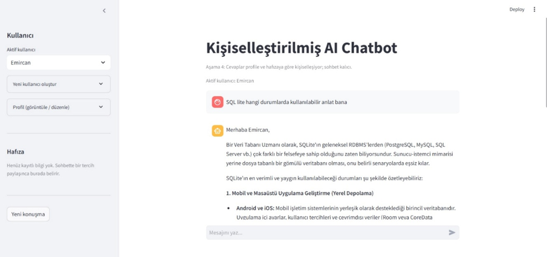
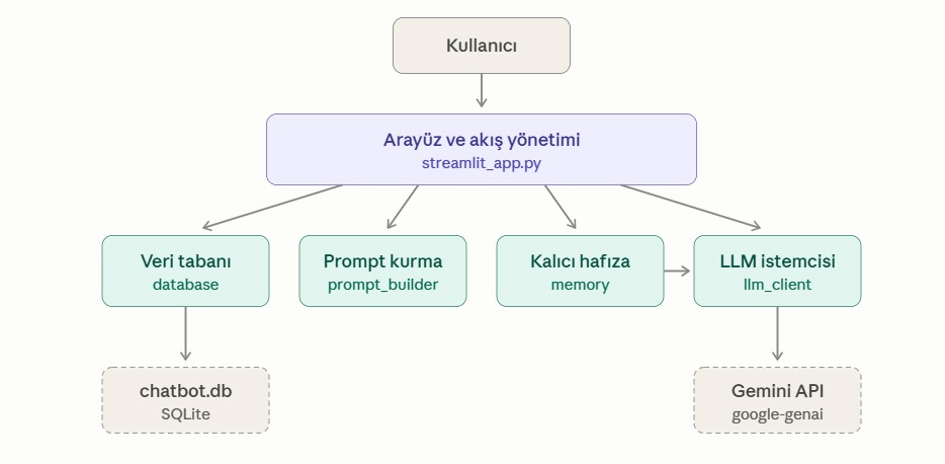
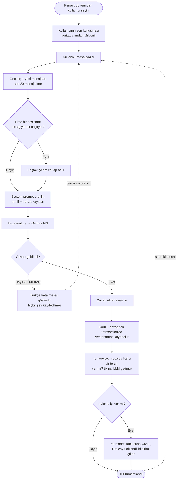
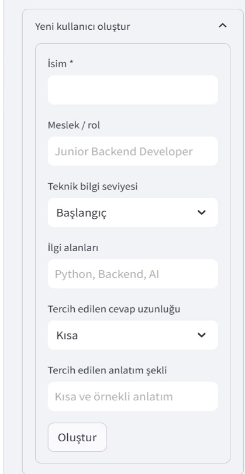

# Kişiselleştirilmiş AI Chatbot


Kullanıcısını tanıyan, cevaplarını kullanıcının profiline ve sohbetlerde
paylaştığı kalıcı tercihlere göre şekillendiren bir sohbet botu. Staj
projesi olarak geliştirilmiştir.



## Özellikler

- **Kullanıcı profilleri:** İsim, rol, teknik seviye, ilgi alanları, cevap
  uzunluğu ve anlatım tercihi. Arayüzden oluşturulur ve düzenlenir.
- **Kişiselleştirilmiş cevaplar:** Profil, her mesajda yeniden üretilen bir
  system prompt'a dönüştürülür.
- **Kalıcı sohbet geçmişi:** Sohbetler SQLite'ta saklanır. Uygulama yeniden
  açıldığında kullanıcının son konuşması kaldığı yerden devam eder.
- **Uzun vadeli hafıza:** Kullanıcının paylaştığı kalıcı tercihler ("bundan
  sonra daha kısa cevap ver" gibi) otomatik olarak çıkarılır ve sonraki tüm
  konuşmalarda uygulanır. Kayıtlar arayüzden görülebilir ve silinebilir.
- **Anlaşılır hata yönetimi:** Geçersiz anahtar, kota aşımı, zaman aşımı gibi
  API hataları kullanıcıya ne yapması gerektiğini anlatan Türkçe mesajlarla
  gösterilir.

## Projenin amacı

Klasik bir soru-cevap botu yerine; kullanıcı profili tutan, konuşma
geçmişini kalıcı olarak saklayan ve kullanıcının sohbette paylaştığı kalıcı
tercihleri sonraki konuşmalarda da uygulayan bir sistem geliştirmek. Aynı
soruyu soran başlangıç seviyesindeki bir junior geliştirici ile ileri
seviyedeki bir veri bilimci, farklı derinlikte ve farklı uzunlukta cevaplar
alır.

Hedeflenen kazanımlar: LLM API entegrasyonu, prompt hazırlama, backend ve
veritabanı geliştirme, hafıza yönetimi.

## Mimari



Kod boyunca uyulan kurallar:

- LLM'e erişim yalnızca `llm_client.py` üzerinden olur. Gemini'ye özgü tüm
  kod orada kalır; dışarıya yalnızca `LLMError` tipinde hata çıkar.
- SQL yalnızca `database.py`'de yaşar. Diğer modüller düz Python sözlükleri
  (`dict`) alır.
- Mesaj formatı her katmanda aynıdır:
  `{"role": "user" | "assistant", "content": "..."}`
- Sırlar koda gömülmez, `.env` dosyasından okunur.

### Bir mesajın akışı



Kayıt bilinçli olarak cevap geldikten **sonra** yapılır. LLM hata verirse ne
veritabanına ne de ekrandaki geçmişe yarım kayıt düşer; kullanıcı aynı
soruyu tekrar sorabilir.

### Proje yapısı

```
.
├── app/
│   ├── __init__.py
│   ├── database.py         # SQLite'a açılan tek kapı (tablolar + sorgular)
│   ├── llm_client.py       # LLM'e açılan tek kapı (Google Gemini)
│   ├── memory.py           # mesajdan kalıcı tercih çıkarımı
│   └── prompt_builder.py   # profil + hafıza → system prompt
├── docs/                   # README görselleri
├── .gitignore
├── example.env             # .env şablonu (gerçek anahtar içermez)
├── main.py                 # terminalden hızlı test aracı
├── README.md
├── requirements.txt
└── streamlit_app.py        # arayüz ve akış (uygulamanın giriş noktası)
```

## Kullanılan teknolojiler

| Katman | Teknoloji |
| --- | --- |
| Dil | Python 3.11 |
| Arayüz | Streamlit 1.41 |
| Veritabanı | SQLite (Python'un yerleşik `sqlite3` modülü) |
| LLM | Google Gemini API (`gemini-3.5-flash-lite`, `google-genai` SDK) |
| Yapılandırma | python-dotenv (`.env` yönetimi) |

## Nasıl çalıştırılır

Gereksinim: Python 3.11 veya üzeri (3.11.9 ile test edildi).

### 1. Sanal ortam ve bağımlılıklar

Windows:

```
python -m venv venv
venv\Scripts\activate
pip install -r requirements.txt
copy example.env .env
```

macOS / Linux:

```
python3 -m venv venv
source venv/bin/activate
pip install -r requirements.txt
cp example.env .env
```

### 2. API anahtarı

`.env` dosyasını açıp değerleri doldur. Anahtar
[Google AI Studio](https://aistudio.google.com/apikey) üzerinden ücretsiz
alınır. `.env` dosyası `.gitignore`'da olduğu için git'e girmez.

| Değişken | Zorunlu | Açıklama |
| --- | --- | --- |
| `GEMINI_API_KEY` | Evet | Google AI Studio'dan alınan API anahtarı |
| `GEMINI_MODEL` | Hayır | Kullanılacak model. Boş bırakılırsa `llm_client.py`'deki `DEFAULT_MODEL` kullanılır |

### 3. Veritabanı ve uygulama

İlk komut tabloları kurar ve demo için farklı teknik seviyede iki örnek
kullanıcı (Ahmet ve Zeynep) ekler. İkinci komut arayüzü başlatır.

```
python -m app.database
streamlit run streamlit_app.py
```

Arayüz olmadan LLM bağlantısını hızlıca denemek için: `python main.py`

## Demo senaryosu

1. `python -m app.database` iki demo kullanıcı oluşturur: **Ahmet** (Junior
   Backend Developer, başlangıç seviyesi, kısa cevap tercihi) ve **Zeynep**
   (Senior Data Scientist, ileri seviye, detaylı cevap tercihi).
2. Kenar çubuğundan Ahmet seçilir ve "Docker nedir?" diye sorulur.
3. Zeynep seçilir ve aynı soru sorulur. İki cevap, seviye ve uzunluk
   bakımından farklıdır.
4. Sohbette kalıcı bir tercih paylaşılır, örneğin "Bundan sonra
   cevaplarında hep kod örneği ver". Sağ altta "Hafızaya eklendi" bildirimi
   çıkar ve kayıt kenar çubuğundaki **Hafıza** bölümünde görünür.
5. **Yeni konuşma** butonuyla yeni bir sohbet açılır ve başka bir soru
   sorulur. Cevap, önceki konuşmada paylaşılan tercihe uyar.

## Kişiselleştirme nasıl yapılıyor?

Profil bilgileri kenar çubuğundaki formdan girilir ve SQLite'ta saklanır:

<p align="center">
  
</p>

Kenar çubuğundan seçilen kullanıcının profili veritabanından okunur ve
`prompt_builder.build_system_prompt` bu bilgilerden bir system prompt
üretir. Prompt her mesajda yeniden üretildiği için profilde ya da hafızada
yapılan bir değişiklik bir sonraki mesajda hemen etkili olur. Boş bırakılan
profil alanları prompt'a hiç yazılmaz.

Aynı soru, farklı profillerde farklı bir system prompt demektir.
Cevapların farklılaşmasının tek kaynağı budur; model tarafında özel bir
ayar yoktur.

<details>
<summary>Örnek: Ahmet için üretilen system prompt'un profil ve hafıza bölümü</summary>

```
Karşındaki kullanıcının profili aşağıda. Bunlar arka plan bilgisi değil, cevabını şekillendiren kurallardır:
- İsim: Ahmet
- Meslek / rol: Junior Backend Developer
- Teknik bilgi seviyesi: Başlangıç
- İlgi alanları: Python, Backend, AI
- Tercih edilen cevap uzunluğu: Kısa
- Tercih edilen anlatım şekli: Örnekli ve sade anlatım

Önceki konuşmalardan akılda tutulan kalıcı bilgiler:
- Kullanıcı cevaplarda kod örneği görmek istiyor.
```

Prompt'un geri kalanında modelin bu bilgileri nasıl uygulayacağını anlatan
kurallar bulunur (seviyeye uy, profili kullanıcıya geri anlatma, o anki
istek profilden önce gelir vb.). Tam metin `app/prompt_builder.py` içindeki
`SYSTEM_TEMPLATE` sabitindedir.

</details>

## Memory sistemi nasıl çalışıyor?

| Katman | Tablo | Ne tutar | Ömrü |
| --- | --- | --- | --- |
| Kısa vadeli | `conversations`, `messages` | Sohbetin mesajları | Konuşma boyunca; LLM'e son 20 mesaj gider |
| Uzun vadeli | `memories` | Kullanıcının kalıcı tercihleri | Kullanıcı silene kadar, tüm konuşmalarda |

**Kısa vadeli (konuşma geçmişi).** Her soru-cevap çifti tek transaction'da
yazılır, bu yüzden yarım kayıt oluşamaz. LLM'e geçmişin tamamı değil son
20 mesaj gönderilir (`MAX_HISTORY_MESSAGES`) ve kesilen liste her zaman bir
kullanıcı mesajıyla başlayacak şekilde ayarlanır. Sebep: API durumsuz
olduğu için geçmiş her istekte yeniden gönderilir; sohbet uzadıkça token
maliyeti ve context limiti sorun olur.

**Uzun vadeli (kalıcı hafıza).** Her kullanıcı mesajından sonra ikinci,
küçük bir LLM çağrısı "bu mesajda kalıcı bir tercih veya bilgi var mı?"
diye sorar (`app/memory.py`). Varsa tek cümlelik özet `memories` tablosuna
yazılır ve o kullanıcının sonraki tüm konuşmalarında system prompt'a
eklenir. Bedeli mesaj başına bir ek API çağrısıdır; yanlış bir kayıt
oluşursa arayüzden silinir.

"Yeni konuşma" butonu eski sohbeti silmez, yalnızca yeni bir konuşma
başlatır. Eski konuşmalar veritabanında kalır, uzun vadeli hafıza ise
konuşmalar arasında taşınır.

## Sağlayıcı değişikliği: OpenAI → Gemini

Proje başlangıçta OpenAI API'siyle yazıldı, sonradan Google Gemini'ye
taşındı. Taşıma sırasında **yalnızca `app/llm_client.py` yeniden yazıldı**;
diğer dosyalarda tek satır kod değişmedi. Hepsi hâlâ aynı iki fonksiyonu
(`ask_llm`, `ask_llm_with_history`) çağırıyor ve aynı `LLMError` tipini
yakalıyor. "LLM'e tek kapıdan erişilir" kuralının somut karşılığı budur.

`llm_client.py` içinde ele alınması gereken farklar:

| Konu | OpenAI | Gemini |
| --- | --- | --- |
| Kütüphane | `openai` | `google-genai` |
| Anahtar | `OPENAI_API_KEY` | `GEMINI_API_KEY` |
| Asistan rolü | `"assistant"` | `"model"` |
| System prompt | Mesaj listesinin ilk elemanı | Ayrı alan: `system_instruction` |
| Uzunluk sınırı | `max_completion_tokens` | `max_output_tokens` |
| Zaman aşımı | Saniye | **Milisaniye** |
| Hata tipleri | `AuthenticationError`, `RateLimitError`... | Tek `APIError` (+ `ClientError` / `ServerError`); ayrım HTTP koduyla |

## Karşılaştığım problemler

- **Sağlayıcı geçişinde rol ve format farkları.** OpenAI'den Gemini'ye
  geçerken `"assistant"` rolünü `"model"`e çevirmeyi unutunca istek hata
  verdi. Ayrıca system prompt Gemini'de mesaj listesine değil ayrı bir
  alana (`system_instruction`) gidiyor. Çözüm: bütün çeviriyi
  `llm_client.py` içindeki `_to_gemini_contents()` fonksiyonunda tek yerde
  yapmak.
- **Zaman aşımı birimi.** Gemini SDK'sında timeout saniye değil milisaniye
  cinsinden (`TIMEOUT_MS = 60_000` = 60 saniye). OpenAI alışkanlığıyla
  yazılan bir değer, fark edilmeden çok kısa bir süreye dönüşebilir.
- **Boş gelen cevaplar.** `max_output_tokens` düşük tutulunca modelin
  cevaptan önce harcadığı düşünme (thinking) tokenları bütçeyi bitirdi ve
  cevap boş geldi. Sınırı 4096'ya çıkardım; cevabın kısalığını artık profil
  tercihleri (system prompt) belirliyor, bu sayı sadece bir güvenlik tavanı.
- **Hata sonrası bozulan sohbet geçmişi.** İlk sürümde kullanıcı mesajı,
  cevap gelmeden sohbet geçmişine ekleniyordu; LLM hata verince geçmişte
  art arda iki kullanıcı mesajı kalıyordu. Artık soru ve cevap yalnızca
  cevap başarıyla gelince, tek bir veritabanı transaction'ında birlikte
  kaydediliyor.
- **Kırpılan geçmişin yanlış yerden başlaması.** Kod incelemesinde ortaya
  çıktı: geçmiş hep soru-cevap çiftlerinden oluştuğu ve sonuna yeni soru
  eklendiği için liste tek sayılı. Son 20 mesaj alınınca, LLM'e giden
  geçmiş sorusu kesilmiş bir cevapla başlayabiliyordu. Baştaki bu "yetim"
  cevap artık atılıyor.

## İleride neler geliştirilebilir?

- Eski konuşmaları listeleyip aralarında gezinme (şu an yalnızca son
  konuşma açılıyor; eskiler veritabanında duruyor ama arayüzde
  listelenmiyor).
- Uzun geçmişi özetleyerek token kullanımını azaltma.
- Hafıza kayıtlarını silmenin yanında düzenleyebilme; çıkarım çağrısını
  asıl cevapla birleştirip API maliyetini düşürme.
- Hafıza çıkarımında modelin cevabını doğrulama ("Kullanıcı ..." kalıbına
  uymayan çıktıları kaydetmeme).
- Birden fazla chatbot karakteri (persona).
- Doküman yükleme ve basit bir RAG sistemi.
- API kullanım maliyetini ölçüp gösterme.
- Onay isteyen kalıcı "geçmişi sil" özelliği.
- Cevabı akışlı (streaming) gösterme: `generate_content_stream` ile kelime
  kelime yazdırma.
- Otomatik testler (pytest); saf bir fonksiyon olan `prompt_builder` ile
  başlamak en kolayı.
